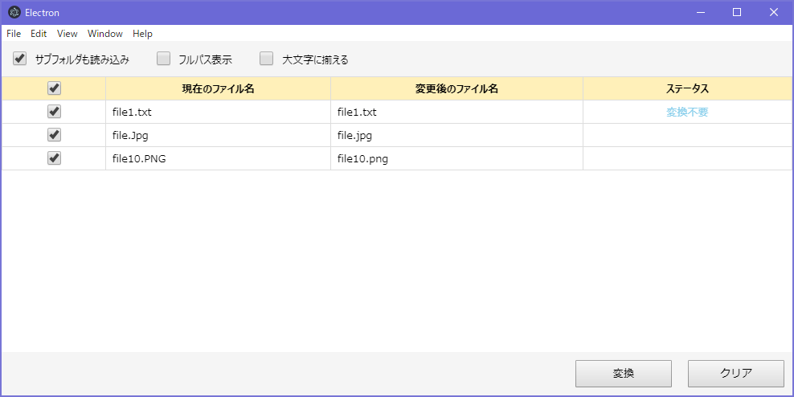

拡張子を揃える GUI ツール

# セットアップ

1. Electron を使ってるので、公式サイトからダウンロード
2. `run.bat` のコメント行に `electron.exe` のパスを入力してコメントを解除 (`@rem` の削除)
3. `run.bat` を実行すると起動する

# 画面

# 使い方

- ファイルかフォルダを画面内にドロップ
- サブフォルダも含めるならチェックをつける
- デフォルトは小文字、大文字にしたいならチェックをつける
- 表のチェックが付いてる行だけが変換対象
- 変換ボタンでリネームの実行
- クリアボタンでリストのクリア

# exFAT 対応

ファイルシステムで大文字小文字の区別がない exFAT では大文字小文字の違いだけでリネームしても同名扱いで変化なしになる 
これの対処のために、一旦別名にリネームしてから変更後のファイル名にリネームしてる
